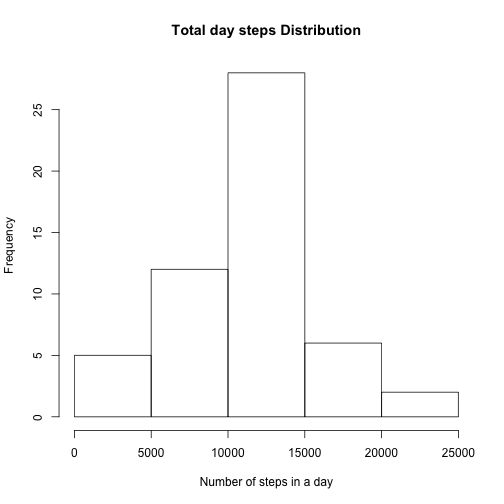
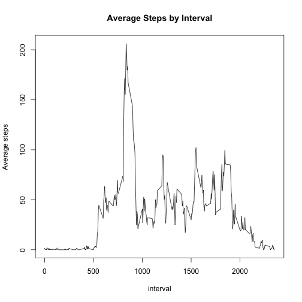
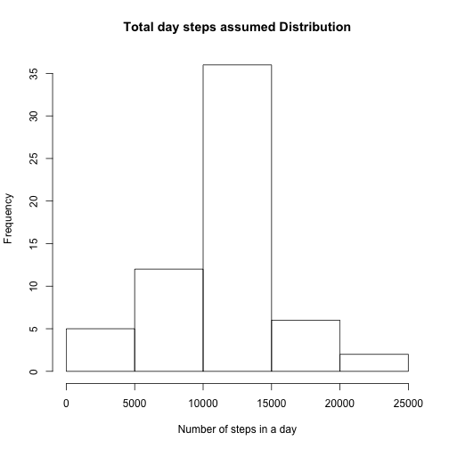
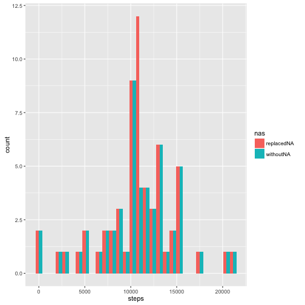
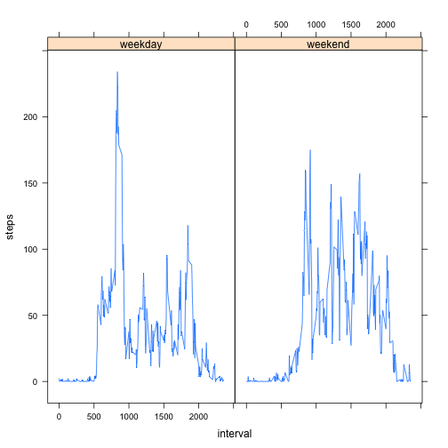

## Loading and preprocessing the data

This assignment makes use of data from a personal activity monitoring device. This device collects data at 5 minute intervals through out the day. The data consists of two months of data from an anonymous individual collected during the months of October and November, 2012 and include the number of steps taken in 5 minute intervals each day.
The data for this assignment can be downloaded from the course web site: 
Dataset : [Activity monitoring data [52K]](https://d396qusza40orc.cloudfront.net/repdata%2Fdata%2Factivity.zip)
The variables included in this dataset are:

* steps: Number of steps taking in a 5-minute interval (missing values are coded as NA)

* date: The date on which the measurement was taken in YYYY-MM-DD format

* interval: Identifier for the 5-minute interval in which measurement was taken

The dataset is stored in a comma-separated-value (CSV) file and there are a total of 17,568 observations in this dataset.

First we read the data and assign it to a variable data, redefining dates characters to dates class. 


```r
library(dplyr)
```

```
## 
## Attaching package: 'dplyr'
```

```
## The following objects are masked from 'package:stats':
## 
##     filter, lag
```

```
## The following objects are masked from 'package:base':
## 
##     intersect, setdiff, setequal, union
```

```r
library(lattice)
library(ggplot2)
```

```
## Warning: package 'ggplot2' was built under R version 3.2.4
```

```r
data<-read.csv("activity.csv")
data$date<-as.Date(data$date)
```


## Average number of steps taken per day.

Here is the total number of steps taken each day (ignoring the missing values in the dataset):


```r
#Counting total steps by day and ignoring NA values.
totalbyday<-summarize(group_by(data,date),sum(steps))
totalbyday<-totalbyday[!is.na(totalbyday[,2]),]
hist(totalbyday$`sum(steps)`,main ="Total day steps Distribution",xlab="Number of steps in a day")
```



```r
Mean<-round(mean(totalbyday$`sum(steps)`))
Median<-round(median(totalbyday$`sum(steps)`))
```

Wich gives us 10 766 as mean and  10 765 as the median number of steps taken per day.

##  Average daily activity pattern

Here is the average daily pattern by Interval


```r
#Average steps by interval ignoring NA values.
stepsbyinterval<-summarize(group_by(data,interval),mean(steps,na.rm=TRUE))
plot(stepsbyinterval,type = "l",main="Average Steps by Interval",ylab="Average steps")
```



```r
Max<-max(stepsbyinterval$`mean(steps, na.rm = TRUE)`)
Interval<-as.integer(stepsbyinterval[stepsbyinterval[,2]==Max,1])
```

We get the Maximum number of steps (206 steps) during the Interval 835, which corresponds to the interval between 13h:55min and 14h:0min

##Imputing missing values


```r
nanum<-sum(is.na(data$steps))
```
 
There are 2304 missing values. The presence of missing days may introduce bias into some calculations or summaries of the data. We fill this missing values using the mean for that 5-minute interval.


```r
dataf<-inner_join(data,stepsbyinterval)
```

```
## Joining by: "interval"
```

```r
names(dataf)[4]<-"mean"
dataf<-mutate(dataf,steps=ifelse(is.na(steps),mean,steps))
```

### Average number of steps taken per day with filled NAs.

Here is the total number of steps estimated for each day when assuming missing values are replaced as explained :


```r
#Counting total steps by day replacing NA values.
totalbyday2<-summarize(group_by(dataf,date),sum(steps))
hist(totalbyday2$`sum(steps)`,main ="Total day steps assumed Distribution",xlab="Number of steps in a day")
```



```r
Mean<-round(mean(totalbyday2$`sum(steps)`))
Median<-round(median(totalbyday2$`sum(steps)`))
```

Wich gives us 10 766 as mean and  10 766 as the median number of steps estimated per day, wich as expected is almost equal to the values obtained without considering NA values.   Nonetheless the distribution is less dispersed around the median in this case, as we are adding more values around the mean... more NA's on intervals on ones next to median values are obtained for total steps.


```r
#Comparative Histogram
totalbyday$nas<-"withoutNA"
totalbyday2$nas<-"replacedNA"
total<-rbind(totalbyday,totalbyday2)
names(total)[2]<-"steps"
g<-ggplot(total,aes(steps,fill=nas))
g+geom_histogram(position="dodge")
```

```
## `stat_bin()` using `bins = 30`. Pick better value with `binwidth`.
```



##Activity patterns between weekdays and weekends


```r
#Creating a new factor variable indicating weekday or weekend in the data set with replaced NA values.
datad<-mutate(data,day=ifelse(weekdays(date) %in% c("Saturday","Sunday"),"weekend","weekday"))
stepsbyinterval<-summarize(group_by(datad,interval,day),mean(steps,na.rm=TRUE))
names(stepsbyinterval)[3]<-"steps"
xyplot(steps~interval|day,stepsbyinterval,type="l",layout = c(2,1))
```



We can see that during weekdays we have more steps during the early midday than in every interval during weekend, and that during weekend we have a more distributed number of steps, wich is in total higher than those done during weekend.

